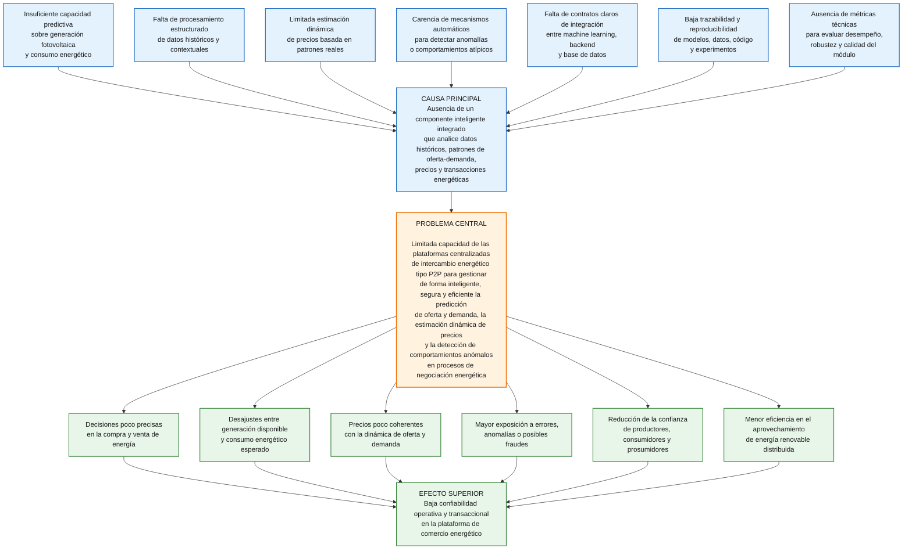

# 

```mermaid
    flowchart TD

    %% =========================
    %% EFECTOS
    %% =========================

    E0["EFECTO SUPERIOR<br/>Baja confiabilidad operativa y transaccional<br/>en la plataforma de comercio energético"]

    E1["Decisiones poco precisas<br/>en la compra y venta de energía"]
    E2["Desajustes entre generación disponible<br/>y consumo energético esperado"]
    E3["Precios poco coherentes<br/>con la dinámica de oferta y demanda"]
    E4["Mayor exposición a errores,<br/>anomalías o posibles fraudes"]
    E5["Reducción de la confianza<br/>de productores, consumidores y prosumidores"]
    E6["Menor eficiencia en el aprovechamiento<br/>de energía renovable distribuida"]

    E1 --> E0
    E2 --> E0
    E3 --> E0
    E4 --> E0
    E5 --> E0
    E6 --> E0

    %% =========================
    %% PROBLEMA CENTRAL
    %% =========================

    P["PROBLEMA CENTRAL<br/><br/>Limitada capacidad de las plataformas centralizadas<br/>de intercambio energético tipo P2P para gestionar<br/>de forma inteligente, segura y eficiente la predicción<br/>de oferta y demanda, la estimación dinámica de precios<br/>y la detección de comportamientos anómalos<br/>en procesos de negociación energética"]

    P --> E1
    P --> E2
    P --> E3
    P --> E4
    P --> E5
    P --> E6

    %% =========================
    %% CAUSAS
    %% =========================

    C0["CAUSA PRINCIPAL<br/>Ausencia de un componente inteligente integrado<br/>que analice datos históricos, patrones de oferta-demanda,<br/>precios y transacciones energéticas"]

    C1["Insuficiente capacidad predictiva<br/>sobre generación fotovoltaica<br/>y consumo energético"]
    C2["Falta de procesamiento estructurado<br/>de datos históricos y contextuales"]
    C3["Limitada estimación dinámica<br/>de precios basada en patrones reales"]
    C4["Carencia de mecanismos automáticos<br/>para detectar anomalías<br/>o comportamientos atípicos"]
    C5["Falta de contratos claros de integración<br/>entre machine learning, backend<br/>y base de datos"]
    C6["Baja trazabilidad y reproducibilidad<br/>de modelos, datos, código<br/>y experimentos"]
    C7["Ausencia de métricas técnicas<br/>para evaluar desempeño,<br/>robustez y calidad del módulo"]

    C1 --> C0
    C2 --> C0
    C3 --> C0
    C4 --> C0
    C5 --> C0
    C6 --> C0
    C7 --> C0

    C0 --> P

    %% =========================
    %% ESTILOS
    %% =========================

    classDef efecto fill:#E8F5E9,stroke:#2E7D32,stroke-width:1.5px,color:#1B1B1B;
    classDef problema fill:#FFF3E0,stroke:#EF6C00,stroke-width:2px,color:#1B1B1B;
    classDef causa fill:#E3F2FD,stroke:#1565C0,stroke-width:1.5px,color:#1B1B1B;

    class E0,E1,E2,E3,E4,E5,E6 efecto;
    class P problema;
    class C0,C1,C2,C3,C4,C5,C6,C7 causa;
```
<b><i> 
    Imagen 00.
    Árbol de problemas asociado a la limitada capacidad inteligente, segura y eficiente en plataformas centralizadas de intercambio energético tipo P2P.
 </i></b>