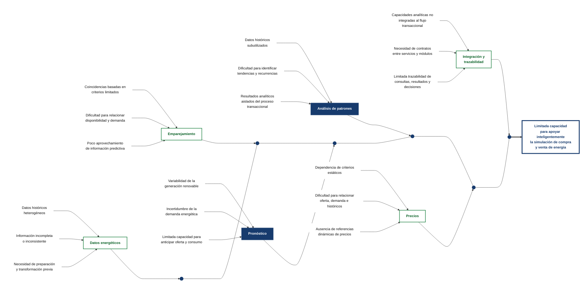

# Diagrama Causa - Efecto - EnerTrade AI

```mermaid

    flowchart LR

    %% =====================================================
    %% DIAGRAMA CAUSA - EFECTO / ISHIKAWA
    %% Proyecto EnerTrade AI
    %% =====================================================


    %% -----------------------------------------------------
    %% BLOQUE SUPERIOR 1 - DATOS ENERGÉTICOS
    %% -----------------------------------------------------

    subgraph SD[" "]

        direction TB

        Datos["Datos energéticos"]

        D1["Datos históricos<br/>heterogéneos"]

        D2["Información incompleta<br/>o inconsistente"]

        D3["Necesidad de preparación<br/>y transformación previa"]

        D1 --> Datos
        D2 --> Datos
        D3 --> Datos

    end


    %% -----------------------------------------------------
    %% BLOQUE SUPERIOR 2 - PRONÓSTICO
    %% -----------------------------------------------------

    subgraph SP[" "]

        direction TB

        Pronostico["Pronóstico"]

        P1["Variabilidad de la<br/>generación renovable"]

        P2["Incertidumbre de la<br/>demanda energética"]

        P3["Limitada capacidad para<br/>anticipar oferta y consumo"]

        P1 --> Pronostico
        P2 --> Pronostico
        P3 --> Pronostico

    end


    %% -----------------------------------------------------
    %% BLOQUE SUPERIOR 3 - PRECIOS
    %% -----------------------------------------------------

    subgraph SPR[" "]

        direction TB

        Precios["Precios"]

        PR1["Dependencia de criterios<br/>estáticos"]

        PR2["Dificultad para relacionar<br/>oferta, demanda e históricos"]

        PR3["Ausencia de referencias<br/>dinámicas de precios"]

        PR1 --> Precios
        PR2 --> Precios
        PR3 --> Precios

    end


    %% -----------------------------------------------------
    %% BLOQUE INFERIOR 1 - EMPAREJAMIENTO
    %% -----------------------------------------------------

    subgraph SE[" "]

        direction BT

        Emparejamiento["Emparejamiento"]

        E1["Coincidencias basadas en<br/>criterios limitados"]

        E2["Dificultad para relacionar<br/>disponibilidad y demanda"]

        E3["Poco aprovechamiento<br/>de información predictiva"]

        E1 --> Emparejamiento
        E2 --> Emparejamiento
        E3 --> Emparejamiento

    end


    %% -----------------------------------------------------
    %% BLOQUE INFERIOR 2 - ANÁLISIS DE PATRONES
    %% -----------------------------------------------------

    subgraph SA[" "]

        direction BT

        Patrones["Análisis de patrones"]

        A1["Datos históricos<br/>subutilizados"]

        A2["Dificultad para identificar<br/>tendencias y recurrencias"]

        A3["Resultados analíticos<br/>aislados del proceso<br/>transaccional"]

        A1 --> Patrones
        A2 --> Patrones
        A3 --> Patrones

    end


    %% -----------------------------------------------------
    %% BLOQUE INFERIOR 3 - INTEGRACIÓN Y TRAZABILIDAD
    %% -----------------------------------------------------

    subgraph SI[" "]

        direction BT

        Integracion["Integración y<br/>trazabilidad"]

        I1["Capacidades analíticas no<br/>integradas al flujo<br/>transaccional"]

        I2["Necesidad de contratos<br/>entre servicios y módulos"]

        I3["Limitada trazabilidad de<br/>consultas, resultados y<br/>decisiones"]

        I1 --> Integracion
        I2 --> Integracion
        I3 --> Integracion

    end


    %% -----------------------------------------------------
    %% ESPINA CENTRAL
    %% -----------------------------------------------------

    N1(( ))
    N2(( ))
    N3(( ))
    N4(( ))
    N5(( ))
    N6(( ))

    N1 --- N2
    N2 --- N3
    N3 --- N4
    N4 --- N5
    N5 --- N6


    %% -----------------------------------------------------
    %% PROBLEMA CENTRAL
    %% -----------------------------------------------------

    Problema["Limitada capacidad<br/>para apoyar inteligentemente<br/>la simulación de compra<br/>y venta de energía"]


    %% -----------------------------------------------------
    %% CONEXIONES SUPERIORES HACIA LA ESPINA
    %% -----------------------------------------------------

    Datos --> N1

    Pronostico --> N3

    Precios --> N5


    %% -----------------------------------------------------
    %% CONEXIONES INFERIORES HACIA LA ESPINA
    %% -----------------------------------------------------

    Emparejamiento --> N2

    Patrones --> N4

    Integracion --> N6


    %% -----------------------------------------------------
    %% EFECTO FINAL
    %% -----------------------------------------------------

    N6 ==> Problema


    %% -----------------------------------------------------
    %% ENLACES INVISIBLES PARA FORZAR DISTRIBUCIÓN
    %% -----------------------------------------------------

    Datos ~~~ Pronostico
    Pronostico ~~~ Precios

    Emparejamiento ~~~ Patrones
    Patrones ~~~ Integracion

    Datos ~~~ Emparejamiento
    Pronostico ~~~ Patrones
    Precios ~~~ Integracion


    %% -----------------------------------------------------
    %% ESTILOS
    %% -----------------------------------------------------

    classDef verde fill:#ffffff,stroke:#08752f,stroke-width:2px,color:#086025,font-weight:bold;

    classDef azul fill:#173b6d,stroke:#173b6d,stroke-width:2px,color:#ffffff,font-weight:bold;

    classDef causa fill:#ffffff,stroke:#ffffff,stroke-width:0px,color:#111111;

    classDef problema fill:#ffffff,stroke:#173b6d,stroke-width:4px,color:#173b6d,font-weight:bold;

    classDef espina fill:#173b6d,stroke:#173b6d,stroke-width:2px,color:#173b6d;

    classDef invisible fill:transparent,stroke:transparent,color:transparent;


    class Datos,Precios,Emparejamiento,Integracion verde;

    class Pronostico,Patrones azul;

    class D1,D2,D3,P1,P2,P3,PR1,PR2,PR3,E1,E2,E3,A1,A2,A3,I1,I2,I3 causa;

    class Problema problema;

    class N1,N2,N3,N4,N5,N6 espina;


    %% -----------------------------------------------------
    %% ESTILO DE SUBGRÁFICOS
    %% -----------------------------------------------------

    style SD fill:transparent,stroke:transparent
    style SP fill:transparent,stroke:transparent
    style SPR fill:transparent,stroke:transparent
    style SE fill:transparent,stroke:transparent
    style SA fill:transparent,stroke:transparent
    style SI fill:transparent,stroke:transparent

```

<b><i>
    Figura 2.
    Diagrama causa-efecto del problema abordado por EnerTrade AI
</i></b>

<i>
    Nota. Elaboración propia (2026).
</i>