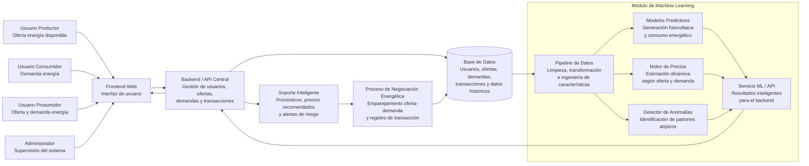

# Diagrama de Arquitectura Lógica - EnerTrade AI

```mermaid
    flowchart LR

    %% Actores principales
    A1[Usuario Productor<br/>Oferta energía disponible]
    A2[Usuario Consumidor<br/>Demanda energía]
    A3[Usuario Prosumidor<br/>Oferta y demanda energía]
    A4[Administrador<br/>Supervisión del sistema]

    %% Capa de presentación
    B[Frontend Web<br/>Interfaz de usuario]

    %% Backend
    C[Backend / API Central<br/>Gestión de usuarios, ofertas,<br/>demandas y transacciones]

    %% Base de datos
    D[(Base de Datos<br/>Usuarios, ofertas, demandas,<br/>transacciones y datos históricos)]

    %% Módulo ML
    subgraph ML[Módulo de Machine Learning]
        E1[Pipeline de Datos<br/>Limpieza, transformación<br/>e ingeniería de características]
        E2[Modelos Predictivos<br/>Generación fotovoltaica<br/>y consumo energético]
        E3[Motor de Precios<br/>Estimación dinámica<br/>según oferta y demanda]
        E4[Detector de Anomalías<br/>Identificación de patrones atípicos]
        E5[Servicio ML / API<br/>Resultados inteligentes<br/>para el backend]
    end

    %% Resultados
    F[Soporte Inteligente<br/>Pronósticos, precios recomendados<br/>y alertas de riesgo]

    G[Proceso de Negociación Energética<br/>Emparejamiento oferta-demanda<br/>y registro de transacción]

    %% Flujo principal
    A1 --> B
    A2 --> B
    A3 --> B
    A4 --> B

    B --> C
    C --> D

    D --> E1
    E1 --> E2
    E1 --> E3
    E1 --> E4

    E2 --> E5
    E3 --> E5
    E4 --> E5

    E5 --> C
    C --> F
    F --> G
    G --> D
    C --> B
```
<b><i> 
    Diagrama 01. 
    Diagrama general de integración del módulo de Machine Learning en la plataforma EnerTrade AI.
 </i></b>