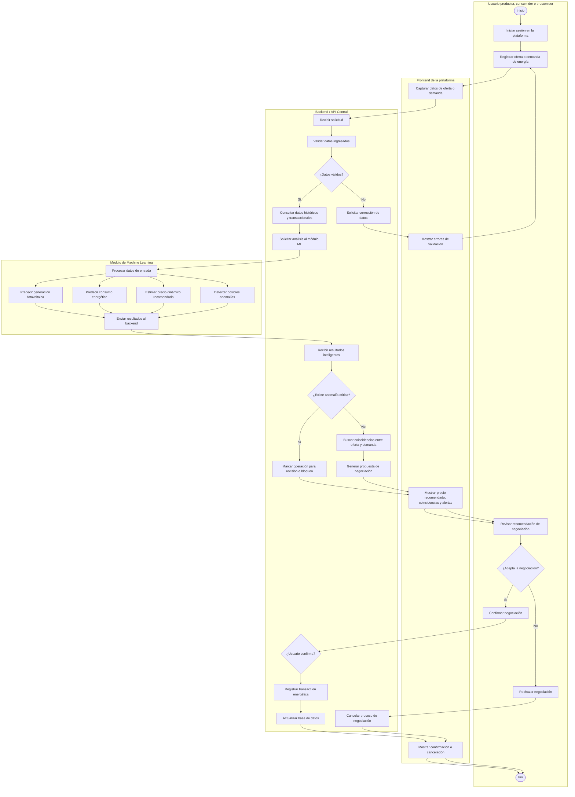

# Diagrama BPMN
 

```mermaid
    flowchart TD

        %% Carril Usuario
        subgraph U[Usuario productor, consumidor o prosumidor]
            U1([Inicio])
            U2[Iniciar sesión en la plataforma]
            U3[Registrar oferta o demanda de energía]
            U4[Revisar recomendación de negociación]
            U5{¿Acepta la negociación?}
            U6[Confirmar negociación]
            U7[Rechazar negociación]
            U8([Fin])
        end

        %% Carril Frontend
        subgraph F[Frontend de la plataforma]
            F1[Capturar datos de oferta o demanda]
            F2[Mostrar errores de validación]
            F3[Mostrar precio recomendado, coincidencias y alertas]
            F4[Mostrar confirmación o cancelación]
        end

        %% Carril Backend
        subgraph B[Backend / API Central]
            B1[Recibir solicitud]
            B2[Validar datos ingresados]
            B3{¿Datos válidos?}
            B4[Solicitar corrección de datos]
            B5[Consultar datos históricos y transaccionales]
            B6[Solicitar análisis al módulo ML]
            B7[Recibir resultados inteligentes]
            B8{¿Existe anomalía crítica?}
            B9[Marcar operación para revisión o bloqueo]
            B10[Buscar coincidencias entre oferta y demanda]
            B11[Generar propuesta de negociación]
            B12{¿Usuario confirma?}
            B13[Registrar transacción energética]
            B14[Cancelar proceso de negociación]
            B15[Actualizar base de datos]
        end

        %% Carril ML
        subgraph M[Módulo de Machine Learning]
            M1[Procesar datos de entrada]
            M2[Predecir generación fotovoltaica]
            M3[Predecir consumo energético]
            M4[Estimar precio dinámico recomendado]
            M5[Detectar posibles anomalías]
            M6[Enviar resultados al backend]
        end

        %% Flujo principal
        U1 --> U2
        U2 --> U3
        U3 --> F1
        F1 --> B1
        B1 --> B2
        B2 --> B3

        B3 -- No --> B4
        B4 --> F2
        F2 --> U3

        B3 -- Sí --> B5
        B5 --> B6
        B6 --> M1
        M1 --> M2
        M1 --> M3
        M1 --> M4
        M1 --> M5
        M2 --> M6
        M3 --> M6
        M4 --> M6
        M5 --> M6

        M6 --> B7
        B7 --> B8

        B8 -- Sí --> B9
        B9 --> F3
        F3 --> U4

        B8 -- No --> B10
        B10 --> B11
        B11 --> F3
        F3 --> U4

        U4 --> U5
        U5 -- Sí --> U6
        U6 --> B12
        B12 --> B13
        B13 --> B15
        B15 --> F4
        F4 --> U8

        U5 -- No --> U7
        U7 --> B14
        B14 --> F4
        F4 --> U8
```
<b><i> 
    Diagrama 02
    Diagrama BPMN del proceso de negociación energética con soporte del módulo de Machine Learning.
 </i></b>