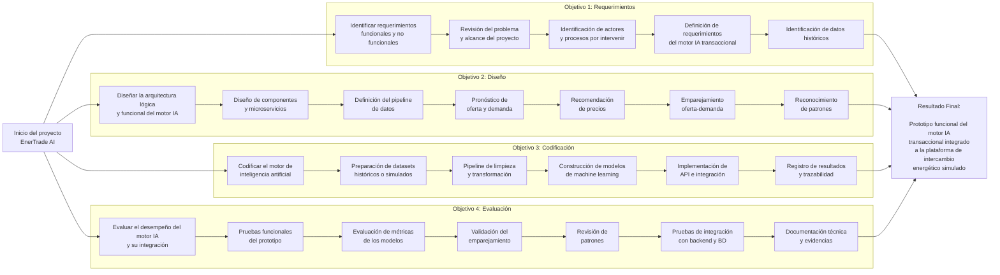

# Ruta metodológica del proyecto

```mermaid
    flowchart LR
    %% Nodo de Inicio que abre las 4 columnas
    A["Inicio del proyecto<br/>EnerTrade AI"] --> B
    A --> C
    A --> D
    A --> E

    %% Columna 1
    subgraph C1 [Objetivo 1: Requerimientos]
        B["Identificar requerimientos<br/>funcionales y no funcionales"] --> B1["Revisión del problema<br/>y alcance del proyecto"]
        B1 --> B2["Identificación de actores<br/>y procesos por intervenir"]
        B2 --> B3["Definición de requerimientos<br/>del motor IA transaccional"]
        B3 --> B4["Identificación de datos históricos"]
    end

    %% Columna 2
    subgraph C2 [Objetivo 2: Diseño]
        C["Diseñar la arquitectura lógica<br/>y funcional del motor IA"] --> C1_2["Diseño de componentes<br/>y microservicios"]
        C1_2 --> C2_2["Definición del pipeline<br/>de datos"]
        C2_2 --> C3["Pronóstico de<br/>oferta y demanda"]
        C3 --> C4["Recomendación<br/>de precios"]
        C4 --> C5["Emparejamiento<br/>oferta-demanda"]
        C5 --> C6["Reconocimiento<br/>de patrones"]
    end

    %% Columna 3
    subgraph C3_sub [Objetivo 3: Codificación]
        D["Codificar el motor de<br/>inteligencia artificial"] --> D1["Preparación de datasets<br/>históricos o simulados"]
        D1 --> D2["Pipeline de limpieza<br/>y transformación"]
        D2 --> D3["Construcción de modelos<br/>de machine learning"]
        D3 --> D4["Implementación de<br/>API e integración"]
        D4 --> D5["Registro de resultados<br/>y trazabilidad"]
    end

    %% Columna 4
    subgraph C4_sub [Objetivo 4: Evaluación]
        E["Evaluar el desempeño del motor IA<br/>y su integración"] --> E1["Pruebas funcionales<br/>del prototipo"]
        E1 --> E2["Evaluación de métricas<br/>de los modelos"]
        E2 --> E3["Validación del<br/>emparejamiento"]
        E3 --> E4["Revisión de<br/>patrones"]
        E4 --> E5["Pruebas de integración<br/>con backend y BD"]
        E5 --> E6["Documentación técnica<br/>y evidencias"]
    end

    %% Cierre de las 4 columnas hacia el resultado final
    B4 --> F
    C6 --> F
    D5 --> F
    E6 --> F

    F["Resultado Final:<br/><br/>Prototipo funcional del motor IA<br/>transaccional integrado<br/>a la plataforma de intercambio<br/>energético simulado"]
```
<b><i> 
    Imagen 00
    Árbol de objetivos del proyecto EnerTrade AI
 </i></b>