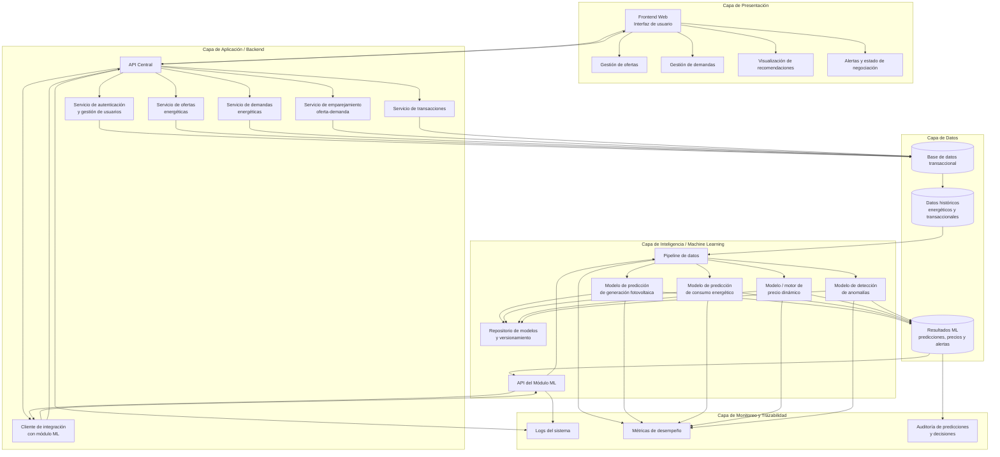

# Arquitectura lógica del sistema

```mermaid
    flowchart TB

        %% Capa de presentación
        subgraph C1[Capa de Presentación]
            UI[Frontend Web<br/>Interfaz de usuario]
            UI1[Gestión de ofertas]
            UI2[Gestión de demandas]
            UI3[Visualización de recomendaciones]
            UI4[Alertas y estado de negociación]
        end

        %% Capa de aplicación
        subgraph C2[Capa de Aplicación / Backend]
            API[API Central]
            AUTH[Servicio de autenticación<br/>y gestión de usuarios]
            OFFER[Servicio de ofertas<br/>energéticas]
            DEMAND[Servicio de demandas<br/>energéticas]
            MATCH[Servicio de emparejamiento<br/>oferta-demanda]
            TRANS[Servicio de transacciones]
            MLCLIENT[Cliente de integración<br/>con módulo ML]
        end

        %% Capa ML
        subgraph C3[Capa de Inteligencia / Machine Learning]
            MLAPI[API del Módulo ML]
            PIPE[Pipeline de datos]
            GEN[Modelo de predicción<br/>de generación fotovoltaica]
            CONS[Modelo de predicción<br/>de consumo energético]
            PRICE[Modelo / motor de<br/>precio dinámico]
            ANOM[Modelo de detección<br/>de anomalías]
            MODELREG[Repositorio de modelos<br/>y versionamiento]
        end

        %% Capa de datos
        subgraph C4[Capa de Datos]
            DB[(Base de datos transaccional)]
            HIST[(Datos históricos<br/>energéticos y transaccionales)]
            RESULT[(Resultados ML<br/>predicciones, precios y alertas)]
        end

        %% Capa de monitoreo
        subgraph C5[Capa de Monitoreo y Trazabilidad]
            LOGS[Logs del sistema]
            METRICS[Métricas de desempeño]
            AUDIT[Auditoría de predicciones<br/>y decisiones]
        end

        %% Relaciones frontend
        UI --> UI1
        UI --> UI2
        UI --> UI3
        UI --> UI4
        UI --> API

        %% Relaciones backend
        API --> AUTH
        API --> OFFER
        API --> DEMAND
        API --> MATCH
        API --> TRANS
        API --> MLCLIENT

        %% Backend a datos
        AUTH --> DB
        OFFER --> DB
        DEMAND --> DB
        MATCH --> DB
        TRANS --> DB

        %% Backend a ML
        MLCLIENT --> MLAPI

        %% ML interno
        MLAPI --> PIPE
        PIPE --> GEN
        PIPE --> CONS
        PIPE --> PRICE
        PIPE --> ANOM
        GEN --> MODELREG
        CONS --> MODELREG
        PRICE --> MODELREG
        ANOM --> MODELREG

        %% Datos para ML
        DB --> HIST
        HIST --> PIPE

        %% Resultados ML
        GEN --> RESULT
        CONS --> RESULT
        PRICE --> RESULT
        ANOM --> RESULT
        RESULT --> MLAPI
        MLAPI --> MLCLIENT
        MLCLIENT --> API
        API --> UI

        %% Monitoreo
        API --> LOGS
        MLAPI --> LOGS
        PIPE --> METRICS
        GEN --> METRICS
        CONS --> METRICS
        PRICE --> METRICS
        ANOM --> METRICS
        RESULT --> AUDIT
```
<b><i> 
    Diagrama 03
    Arquitectura lógica de la plataforma EnerTrade AI con integración del módulo de Machine Learning.
 </i></b>