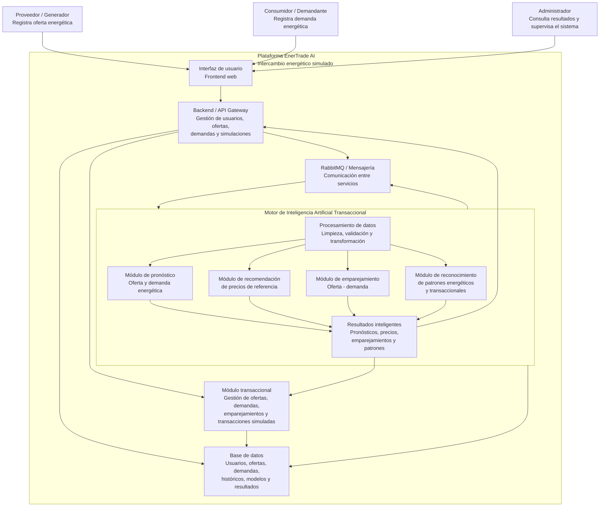

# Diagrama de Arquitectura Lógica - EnerTrade AI

```mermaid
    flowchart TB

    %% Actores externos
    Proveedor["Proveedor / Generador<br/>Registra oferta energética"]
    Consumidor["Consumidor / Demandante<br/>Registra demanda energética"]
    Admin["Administrador<br/>Consulta resultados y supervisa el sistema"]

    %% Plataforma central
    subgraph Plataforma["Plataforma EnerTrade AI<br/>Intercambio energético simulado"]
        
        UI["Interfaz de usuario<br/>Frontend web"]

        Backend["Backend / API Gateway<br/>Gestión de usuarios, ofertas,<br/>demandas y simulaciones"]

        Transaccional["Módulo transaccional<br/>Gestión de ofertas, demandas,<br/>emparejamientos y transacciones simuladas"]

        BD["Base de datos<br/>Usuarios, ofertas, demandas,<br/>históricos, modelos y resultados"]

        Mensajeria["RabbitMQ / Mensajería<br/>Comunicación entre servicios"]

        subgraph MotorIA["Motor de Inteligencia Artificial Transaccional"]
            Datos["Procesamiento de datos<br/>Limpieza, validación y transformación"]

            Pronostico["Módulo de pronóstico<br/>Oferta y demanda energética"]

            Precios["Módulo de recomendación<br/>de precios de referencia"]

            Emparejamiento["Módulo de emparejamiento<br/>Oferta - demanda"]

            Patrones["Módulo de reconocimiento<br/>de patrones energéticos<br/>y transaccionales"]

            Resultados["Resultados inteligentes<br/>Pronósticos, precios,<br/>emparejamientos y patrones"]
        end
    end

    %% Relaciones actores
    Proveedor --> UI
    Consumidor --> UI
    Admin --> UI

    %% Flujo plataforma
    UI --> Backend
    Backend --> Transaccional
    Backend --> BD
    Backend --> Mensajeria
    Mensajeria --> MotorIA
    MotorIA --> Mensajeria
    MotorIA --> BD
    Transaccional --> BD

    %% Flujo interno IA
    Datos --> Pronostico
    Datos --> Precios
    Datos --> Emparejamiento
    Datos --> Patrones

    Pronostico --> Resultados
    Precios --> Resultados
    Emparejamiento --> Resultados
    Patrones --> Resultados

    Resultados --> Backend
    Resultados --> Transaccional
```
<b><i> 
    Diagrama 01. 
    Diagrama de arquitectura lógica del motor de inteligencia artificial transaccional EnerTrade AI.
 </i></b>