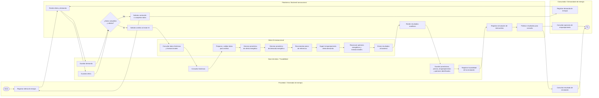

# Diagrama BPMN
 

```mermaid
    flowchart LR

    %% Carril Proveedor
    subgraph L1["Proveedor / Generador de energía"]
        A1(["Inicio"])
        A2["Registrar oferta de energía"]
        A3["Consultar resultado de simulación"]
    end

    %% Carril Consumidor
    subgraph L2["Consumidor / Demandante de energía"]
        B1["Registrar demanda de energía"]
        B2["Consultar opciones de emparejamiento"]
        B3(["Fin"])
    end

    %% Carril Plataforma / Backend
    subgraph L3["Plataforma / Backend transaccional"]
        C1["Recibir oferta y demanda"]
        C2{"¿Datos completos<br/>y válidos?"}
        C3["Solicitar análisis al motor IA"]
        C4["Recibir resultados analíticos"]
        C5["Registrar simulación de intercambio"]
        C6["Publicar resultados para consulta"]
        C7["Solicitar corrección<br/>o completar datos"]
    end

    %% Carril Motor IA
    subgraph L4["Motor IA transaccional"]
        D1["Consultar datos históricos<br/>y transaccionales"]
        D2["Preparar y validar datos<br/>para análisis"]
        D3["Generar pronóstico<br/>de oferta energética"]
        D4["Generar pronóstico<br/>de demanda energética"]
        D5["Recomendar precio<br/>de referencia"]
        D6["Sugerir emparejamiento<br/>oferta-demanda"]
        D7["Reconocer patrones<br/>energéticos y transaccionales"]
        D8["Enviar resultados<br/>al backend"]
    end

    %% Carril Base de Datos
    subgraph L5["Base de datos / Trazabilidad"]
        E1["Guardar oferta"]
        E2["Guardar demanda"]
        E3["Consultar históricos"]
        E4["Guardar pronósticos,<br/>precios, emparejamientos<br/>y patrones identificados"]
        E5["Registrar trazabilidad<br/>de la simulación"]
    end

    %% Flujo principal
    A1 --> A2
    A2 --> C1
    B1 --> C1

    C1 --> E1
    C1 --> E2
    E1 --> C2
    E2 --> C2

    C2 -- "Sí" --> C3
    C2 -- "No" --> C7
    C7 --> A2
    C7 --> B1

    C3 --> D1
    D1 --> E3
    E3 --> D2

    D2 --> D3
    D3 --> D4
    D4 --> D5
    D5 --> D6
    D6 --> D7
    D7 --> D8

    D8 --> C4
    C4 --> E4
    E4 --> E5
    E5 --> C5
    C5 --> C6

    C6 --> A3
    C6 --> B2
    A3 --> B3
    B2 --> B3
```
<b><i> 
    Diagrama 04. 
    Diagrama BPMN del proceso de intercambio energético simulado en EnerTrade AI
 </i></b>