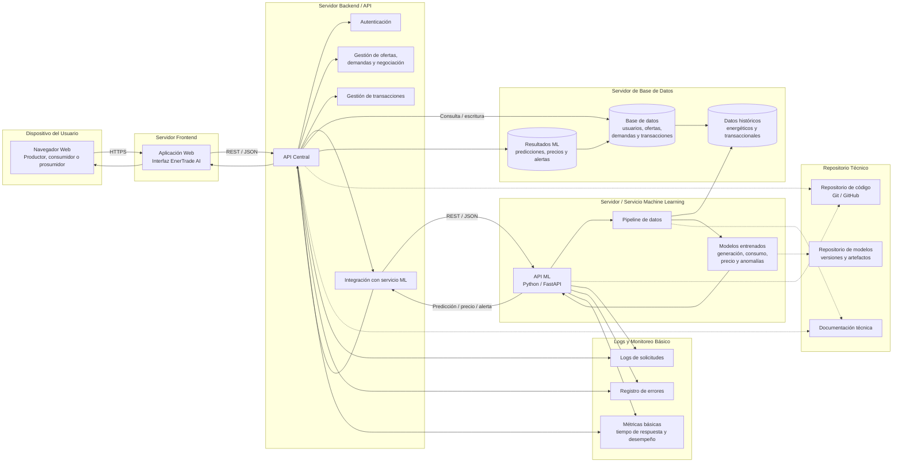

# Arquitectura física / despliegue del prototipo

```mermaid
    flowchart LR

    %% Usuario
    subgraph N1[Dispositivo del Usuario]
        U1[Navegador Web<br/>Productor, consumidor o prosumidor]
    end

    %% Frontend
    subgraph N2[Servidor Frontend]
        FE[Aplicación Web<br/>Interfaz EnerTrade AI]
    end

    %% Backend
    subgraph N3[Servidor Backend / API]
        API[API Central]
        AUTH[Autenticación]
        NEG[Gestión de ofertas,<br/>demandas y negociación]
        TX[Gestión de transacciones]
        INT[Integración con servicio ML]
    end

    %% ML
    subgraph N4[Servidor / Servicio Machine Learning]
        MLAPI[API ML<br/>Python / FastAPI]
        PIPE[Pipeline de datos]
        MODELS[Modelos entrenados<br/>generación, consumo,<br/>precio y anomalías]
    end

    %% Datos
    subgraph N5[Servidor de Base de Datos]
        DB[(Base de datos<br/>usuarios, ofertas,<br/>demandas y transacciones)]
        HIST[(Datos históricos<br/>energéticos y transaccionales)]
        MLRESULT[(Resultados ML<br/>predicciones, precios y alertas)]
    end

    %% Repositorios
    subgraph N6[Repositorio Técnico]
        CODE[Repositorio de código<br/>Git / GitHub]
        MODELREG[Repositorio de modelos<br/>versiones y artefactos]
        DOCS[Documentación técnica]
    end

    %% Monitoreo
    subgraph N7[Logs y Monitoreo Básico]
        LOGS[Logs de solicitudes]
        ERR[Registro de errores]
        MET[Métricas básicas<br/>tiempo de respuesta y desempeño]
    end

    %% Flujo principal
    U1 -->|HTTPS| FE
    FE -->|REST / JSON| API

    API --> AUTH
    API --> NEG
    API --> TX
    API --> INT

    API -->|Consulta / escritura| DB
    DB --> HIST

    INT -->|REST / JSON| MLAPI
    MLAPI --> PIPE
    PIPE --> HIST
    PIPE --> MODELS
    MODELS --> MLAPI
    MLAPI -->|Predicción / precio / alerta| INT

    INT --> API
    API --> MLRESULT
    MLRESULT --> DB
    API --> FE
    FE --> U1

    %% Repositorio
    API -.-> CODE
    MLAPI -.-> CODE
    MODELS -.-> MODELREG
    PIPE -.-> DOCS
    API -.-> DOCS

    %% Monitoreo
    API --> LOGS
    MLAPI --> LOGS
    API --> ERR
    MLAPI --> ERR
    MLAPI --> MET
    API --> MET
```
<b><i> 
    Diagrama 05. 
    Arquitectura física de despliegue del prototipo EnerTrade AI.
 </i></b>