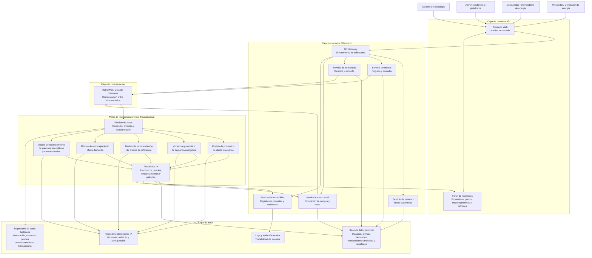

# Arquitectura lógica del sistema

```mermaid
    flowchart TB

    %% Actores externos
    Proveedor["Proveedor / Generador de energía"]
    Consumidor["Consumidor / Demandante de energía"]
    Admin["Administrador de la plataforma"]
    GerenteTec["Gerente de tecnología"]

    %% Capa de presentación
    subgraph Presentacion["Capa de presentación"]
        Frontend["Frontend Web<br/>Interfaz de usuario"]
        Dashboard["Panel de resultados<br/>Pronósticos, precios,<br/>emparejamientos y patrones"]
    end

    %% Capa de servicios
    subgraph Servicios["Capa de servicios / Backend"]
        APIGateway["API Gateway<br/>Enrutamiento de solicitudes"]
        ServicioUsuarios["Servicio de usuarios<br/>Roles y permisos"]
        ServicioOfertas["Servicio de ofertas<br/>Registro y consulta"]
        ServicioDemandas["Servicio de demandas<br/>Registro y consulta"]
        ServicioTransaccional["Servicio transaccional<br/>Simulación de compra y venta"]
        ServicioTrazabilidad["Servicio de trazabilidad<br/>Registro de consultas y resultados"]
    end

    %% Comunicación
    subgraph Comunicacion["Capa de comunicación"]
        RabbitMQ["RabbitMQ / Cola de mensajes<br/>Comunicación entre microservicios"]
    end

    %% Motor IA
    subgraph MotorIA["Motor de Inteligencia Artificial Transaccional"]
        Pipeline["Pipeline de datos<br/>Validación, limpieza y transformación"]
        ModeloOferta["Modelo de pronóstico<br/>de oferta energética"]
        ModeloDemanda["Modelo de pronóstico<br/>de demanda energética"]
        ModeloPrecio["Modelo de recomendación<br/>de precios de referencia"]
        ModeloEmparejamiento["Módulo de emparejamiento<br/>oferta-demanda"]
        ModeloPatrones["Módulo de reconocimiento<br/>de patrones energéticos<br/>y transaccionales"]
        ResultadosIA["Resultados IA<br/>Pronósticos, precios,<br/>emparejamientos y patrones"]
    end

    %% Capa de datos
    subgraph Datos["Capa de datos"]
        BD["Base de datos principal<br/>Usuarios, ofertas, demandas,<br/>transacciones simuladas y resultados"]
        Historicos["Repositorio de datos históricos<br/>Generación, consumo, precios<br/>y comportamiento transaccional"]
        Modelos["Repositorio de modelos IA<br/>Versiones, métricas y configuración"]
        Logs["Logs y auditoría técnica<br/>Trazabilidad de eventos"]
    end

    %% Relaciones actores
    Proveedor --> Frontend
    Consumidor --> Frontend
    Admin --> Frontend
    GerenteTec --> Frontend

    %% Presentación
    Frontend --> APIGateway
    Dashboard --> Frontend

    %% Backend
    APIGateway --> ServicioUsuarios
    APIGateway --> ServicioOfertas
    APIGateway --> ServicioDemandas
    APIGateway --> ServicioTransaccional
    APIGateway --> ServicioTrazabilidad

    ServicioUsuarios --> BD
    ServicioOfertas --> BD
    ServicioDemandas --> BD
    ServicioTransaccional --> BD
    ServicioTrazabilidad --> Logs

    %% Comunicación con motor IA
    ServicioTransaccional --> RabbitMQ
    ServicioOfertas --> RabbitMQ
    ServicioDemandas --> RabbitMQ
    RabbitMQ --> Pipeline

    %% Flujo IA
    Pipeline --> ModeloOferta
    Pipeline --> ModeloDemanda
    Pipeline --> ModeloPrecio
    Pipeline --> ModeloEmparejamiento
    Pipeline --> ModeloPatrones

    ModeloOferta --> ResultadosIA
    ModeloDemanda --> ResultadosIA
    ModeloPrecio --> ResultadosIA
    ModeloEmparejamiento --> ResultadosIA
    ModeloPatrones --> ResultadosIA

    %% Datos del motor IA
    Pipeline --> Historicos
    ModeloOferta --> Modelos
    ModeloDemanda --> Modelos
    ModeloPrecio --> Modelos
    ModeloEmparejamiento --> Modelos
    ModeloPatrones --> Modelos

    ResultadosIA --> BD
    ResultadosIA --> ServicioTrazabilidad
    ResultadosIA --> ServicioTransaccional
    ResultadosIA --> Dashboard
```
<b><i> 
    Diagrama 03. 
    Arquitectura lógica del sistema EnerTrade AI.
 </i></b>