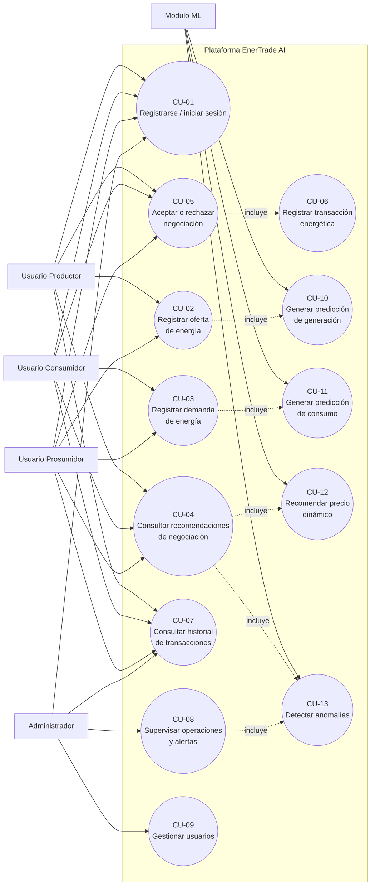

# Casos de uso principales del sistema

```mermaid
    flowchart LR

    %% Actores
    Productor[Usuario Productor]
    Consumidor[Usuario Consumidor]
    Prosumidor[Usuario Prosumidor]
    Admin[Administrador]
    ML[Módulo ML]

    %% Sistema
    subgraph Sistema[Plataforma EnerTrade AI]
        CU01((CU-01<br/>Registrarse / iniciar sesión))
        CU02((CU-02<br/>Registrar oferta<br/>de energía))
        CU03((CU-03<br/>Registrar demanda<br/>de energía))
        CU04((CU-04<br/>Consultar recomendaciones<br/>de negociación))
        CU05((CU-05<br/>Aceptar o rechazar<br/>negociación))
        CU06((CU-06<br/>Registrar transacción<br/>energética))
        CU07((CU-07<br/>Consultar historial<br/>de transacciones))
        CU08((CU-08<br/>Supervisar operaciones<br/>y alertas))
        CU09((CU-09<br/>Gestionar usuarios))

        CU10((CU-10<br/>Generar predicción<br/>de generación))
        CU11((CU-11<br/>Generar predicción<br/>de consumo))
        CU12((CU-12<br/>Recomendar precio<br/>dinámico))
        CU13((CU-13<br/>Detectar anomalías))
    end

    %% Relaciones usuarios
    Productor --> CU01
    Productor --> CU02
    Productor --> CU04
    Productor --> CU05
    Productor --> CU07

    Consumidor --> CU01
    Consumidor --> CU03
    Consumidor --> CU04
    Consumidor --> CU05
    Consumidor --> CU07

    Prosumidor --> CU01
    Prosumidor --> CU02
    Prosumidor --> CU03
    Prosumidor --> CU04
    Prosumidor --> CU05
    Prosumidor --> CU07

    %% Administrador
    Admin --> CU01
    Admin --> CU08
    Admin --> CU09
    Admin --> CU07

    %% ML
    ML --> CU10
    ML --> CU11
    ML --> CU12
    ML --> CU13

    %% Inclusiones funcionales
    CU02 -. incluye .-> CU10
    CU03 -. incluye .-> CU11
    CU04 -. incluye .-> CU12
    CU04 -. incluye .-> CU13
    CU05 -. incluye .-> CU06
    CU08 -. incluye .-> CU13
```
<b><i> 
    Diagrama 06. 
    Diagrama de casos de uso de la plataforma EnerTrade AI con soporte del módulo de Machine Learning.
 </i></b>