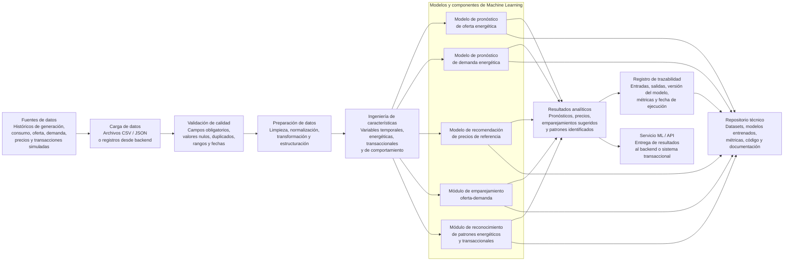

# Pipeline interno del módulo de Machine Learning

```mermaid
    flowchart LR

    %% Entradas de datos
    A["Fuentes de datos<br/>Históricos de generación,<br/>consumo, oferta, demanda,<br/>precios y transacciones simuladas"]

    B["Carga de datos<br/>Archivos CSV / JSON<br/>o registros desde backend"]

    C["Validación de calidad<br/>Campos obligatorios,<br/>valores nulos, duplicados,<br/>rangos y fechas"]

    D["Preparación de datos<br/>Limpieza, normalización,<br/>transformación y estructuración"]

    E["Ingeniería de características<br/>Variables temporales,<br/>energéticas, transaccionales<br/>y de comportamiento"]

    %% Modelos ML
    subgraph Modelos["Modelos y componentes de Machine Learning"]

        F["Modelo de pronóstico<br/>de oferta energética"]

        G["Modelo de pronóstico<br/>de demanda energética"]

        H["Modelo de recomendación<br/>de precios de referencia"]

        I["Módulo de emparejamiento<br/>oferta-demanda"]

        J["Módulo de reconocimiento<br/>de patrones energéticos<br/>y transaccionales"]
    end

    %% Salidas
    K["Resultados analíticos<br/>Pronósticos, precios,<br/>emparejamientos sugeridos<br/>y patrones identificados"]

    L["Registro de trazabilidad<br/>Entradas, salidas, versión del modelo,<br/>métricas y fecha de ejecución"]

    M["Servicio ML / API<br/>Entrega de resultados<br/>al backend o sistema transaccional"]

    N["Repositorio técnico<br/>Datasets, modelos entrenados,<br/>métricas, código y documentación"]

    %% Flujo principal
    A --> B
    B --> C
    C --> D
    D --> E

    E --> F
    E --> G
    E --> H
    E --> I
    E --> J

    F --> K
    G --> K
    H --> K
    I --> K
    J --> K

    K --> L
    K --> M
    L --> N
    F --> N
    G --> N
    H --> N
    I --> N
    J --> N
```
<b><i> 
    Diagrama 04. 
    Pipeline interno del módulo de Machine Learning para soporte a la negociación energética.
 </i></b>