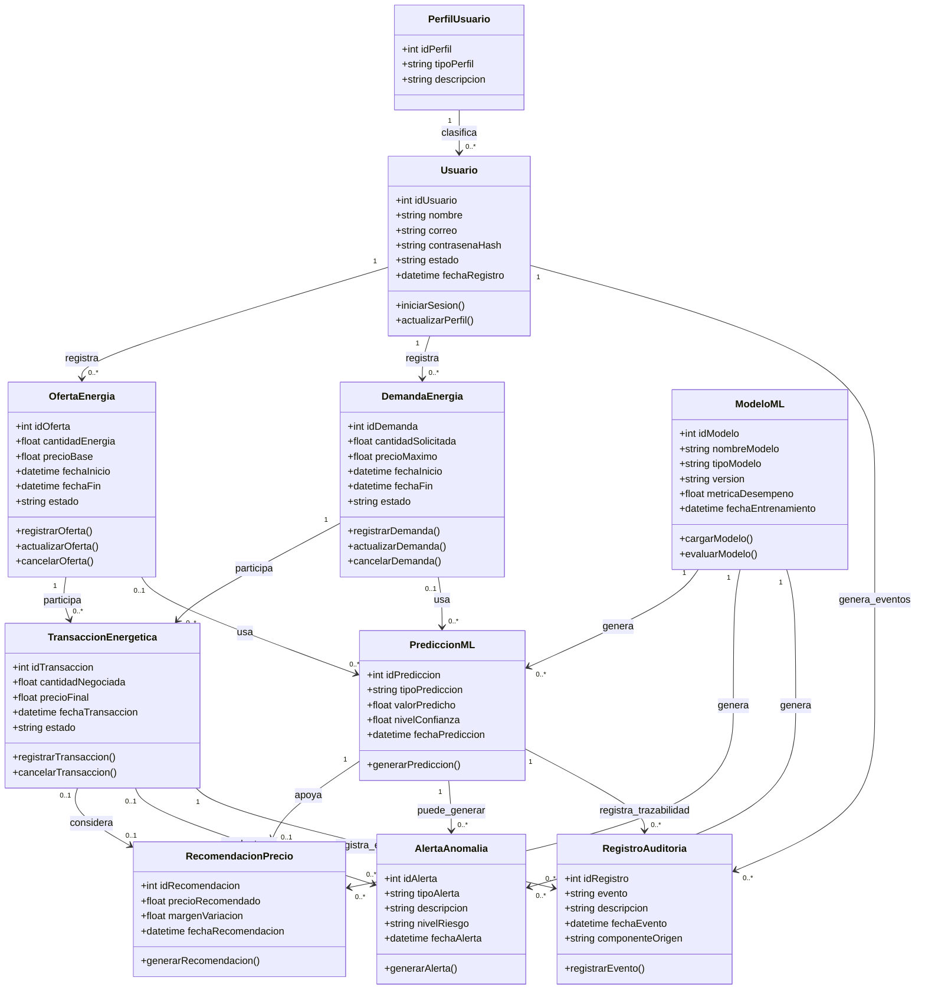

# Diagrama de clases conceptual

```mermaid
    classDiagram

    class Usuario {
        +int idUsuario
        +string nombre
        +string correo
        +string contrasenaHash
        +string estado
        +datetime fechaRegistro
        +iniciarSesion()
        +actualizarPerfil()
    }

    class PerfilUsuario {
        +int idPerfil
        +string tipoPerfil
        +string descripcion
    }

    class OfertaEnergia {
        +int idOferta
        +float cantidadEnergia
        +float precioBase
        +datetime fechaInicio
        +datetime fechaFin
        +string estado
        +registrarOferta()
        +actualizarOferta()
        +cancelarOferta()
    }

    class DemandaEnergia {
        +int idDemanda
        +float cantidadSolicitada
        +float precioMaximo
        +datetime fechaInicio
        +datetime fechaFin
        +string estado
        +registrarDemanda()
        +actualizarDemanda()
        +cancelarDemanda()
    }

    class TransaccionEnergetica {
        +int idTransaccion
        +float cantidadNegociada
        +float precioFinal
        +datetime fechaTransaccion
        +string estado
        +registrarTransaccion()
        +cancelarTransaccion()
    }

    class PrediccionML {
        +int idPrediccion
        +string tipoPrediccion
        +float valorPredicho
        +float nivelConfianza
        +datetime fechaPrediccion
        +generarPrediccion()
    }

    class RecomendacionPrecio {
        +int idRecomendacion
        +float precioRecomendado
        +float margenVariacion
        +datetime fechaRecomendacion
        +generarRecomendacion()
    }

    class AlertaAnomalia {
        +int idAlerta
        +string tipoAlerta
        +string descripcion
        +string nivelRiesgo
        +datetime fechaAlerta
        +generarAlerta()
    }

    class ModeloML {
        +int idModelo
        +string nombreModelo
        +string tipoModelo
        +string version
        +float metricaDesempeno
        +datetime fechaEntrenamiento
        +cargarModelo()
        +evaluarModelo()
    }

    class RegistroAuditoria {
        +int idRegistro
        +string evento
        +string descripcion
        +datetime fechaEvento
        +string componenteOrigen
        +registrarEvento()
    }

    %% Relaciones principales
    PerfilUsuario "1" --> "0..*" Usuario : clasifica

    Usuario "1" --> "0..*" OfertaEnergia : registra
    Usuario "1" --> "0..*" DemandaEnergia : registra

    OfertaEnergia "1" --> "0..*" TransaccionEnergetica : participa
    DemandaEnergia "1" --> "0..*" TransaccionEnergetica : participa

    OfertaEnergia "0..1" --> "0..*" PrediccionML : usa
    DemandaEnergia "0..1" --> "0..*" PrediccionML : usa

    PrediccionML "1" --> "0..1" RecomendacionPrecio : apoya
    PrediccionML "1" --> "0..*" AlertaAnomalia : puede_generar

    ModeloML "1" --> "0..*" PrediccionML : genera
    ModeloML "1" --> "0..*" RecomendacionPrecio : genera
    ModeloML "1" --> "0..*" AlertaAnomalia : genera

    TransaccionEnergetica "0..1" --> "0..1" RecomendacionPrecio : considera
    TransaccionEnergetica "0..1" --> "0..*" AlertaAnomalia : puede_tener

    Usuario "1" --> "0..*" RegistroAuditoria : genera_eventos
    PrediccionML "1" --> "0..*" RegistroAuditoria : registra_trazabilidad
    TransaccionEnergetica "1" --> "0..*" RegistroAuditoria : registra_eventos
```
<b><i> 
    Diagrama 07
    Diagrama de clases conceptual de la plataforma EnerTrade AI.
 </i></b>