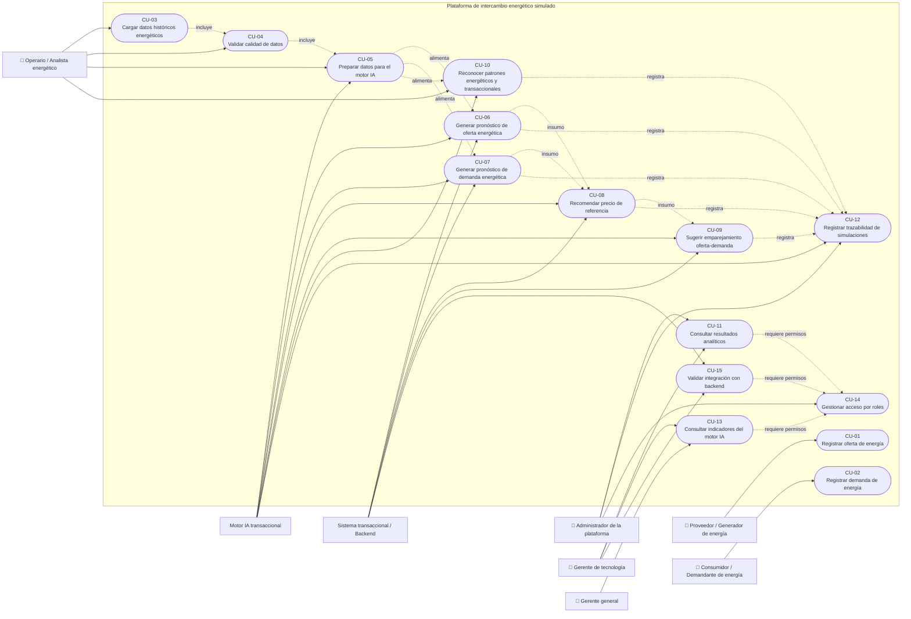

# Casos de uso principales del sistema

```mermaid
    flowchart LR
    %% Actores
    Proveedor["👤 Proveedor / Generador de energía"]
    Consumidor["👤 Consumidor / Demandante de energía"]
    Analista["👤 Operario / Analista energético"]
    Admin["👤 Administrador de la plataforma"]
    GTech["👤 Gerente de tecnología"]
    GGeneral["👤 Gerente general"]
    Backend["Sistema transaccional / Backend"]
    MotorIA["Motor IA transaccional"]

    %% Sistema
    subgraph Plataforma["Plataforma de intercambio energético simulado"]
        CU01(["CU-01<br/>Registrar oferta de energía"])
        CU02(["CU-02<br/>Registrar demanda de energía"])
        CU03(["CU-03<br/>Cargar datos históricos energéticos"])
        CU04(["CU-04<br/>Validar calidad de datos"])
        CU05(["CU-05<br/>Preparar datos para el motor IA"])

        CU06(["CU-06<br/>Generar pronóstico de oferta energética"])
        CU07(["CU-07<br/>Generar pronóstico de demanda energética"])
        CU08(["CU-08<br/>Recomendar precio de referencia"])
        CU09(["CU-09<br/>Sugerir emparejamiento oferta-demanda"])
        CU10(["CU-10<br/>Reconocer patrones energéticos y transaccionales"])

        CU11(["CU-11<br/>Consultar resultados analíticos"])
        CU12(["CU-12<br/>Registrar trazabilidad de simulaciones"])
        CU13(["CU-13<br/>Consultar indicadores del motor IA"])
        CU14(["CU-14<br/>Gestionar acceso por roles"])
        CU15(["CU-15<br/>Validar integración con backend"])
    end

    %% Relaciones actor - caso de uso
    Proveedor --> CU01
    Consumidor --> CU02

    Analista --> CU03
    Analista --> CU04
    Analista --> CU05
    Analista --> CU10

    Backend --> CU06
    Backend --> CU07
    Backend --> CU08
    Backend --> CU09
    Backend --> CU15

    MotorIA --> CU05
    MotorIA --> CU06
    MotorIA --> CU07
    MotorIA --> CU08
    MotorIA --> CU09
    MotorIA --> CU10
    MotorIA --> CU12

    Admin --> CU11
    Admin --> CU12
    Admin --> CU14

    GTech --> CU11
    GTech --> CU13
    GTech --> CU15

    GGeneral --> CU13

    %% Relaciones internas
    CU03 -. incluye .-> CU04
    CU04 -. incluye .-> CU05
    CU05 -. alimenta .-> CU06
    CU05 -. alimenta .-> CU07
    CU05 -. alimenta .-> CU10

    CU06 -. insumo .-> CU08
    CU07 -. insumo .-> CU08
    CU08 -. insumo .-> CU09

    CU06 -. registra .-> CU12
    CU07 -. registra .-> CU12
    CU08 -. registra .-> CU12
    CU09 -. registra .-> CU12
    CU10 -. registra .-> CU12

    CU11 -. requiere permisos .-> CU14
    CU13 -. requiere permisos .-> CU14
    CU15 -. requiere permisos .-> CU14
```
<b><i> 
    Diagrama 06. 
    Diagrama de casos de uso principales del sistema EnerTrade AI.
 </i></b>