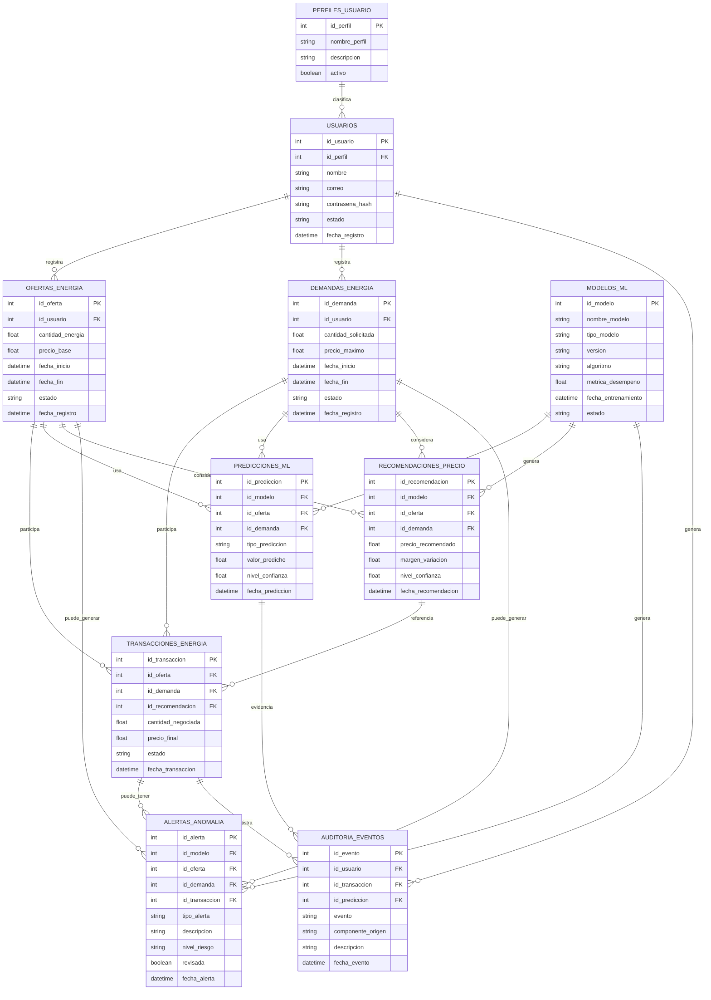

# Modelo entidad-relación conceptual

```mermaid
    erDiagram

    PERFILES_USUARIO {
        int id_perfil PK
        string nombre_perfil
        string descripcion
        boolean activo
    }

    USUARIOS {
        int id_usuario PK
        int id_perfil FK
        string nombre
        string correo
        string contrasena_hash
        string estado
        datetime fecha_registro
    }

    OFERTAS_ENERGIA {
        int id_oferta PK
        int id_usuario FK
        float cantidad_energia
        float precio_base
        datetime fecha_inicio
        datetime fecha_fin
        string estado
        datetime fecha_registro
    }

    DEMANDAS_ENERGIA {
        int id_demanda PK
        int id_usuario FK
        float cantidad_solicitada
        float precio_maximo
        datetime fecha_inicio
        datetime fecha_fin
        string estado
        datetime fecha_registro
    }

    TRANSACCIONES_ENERGIA {
        int id_transaccion PK
        int id_oferta FK
        int id_demanda FK
        int id_recomendacion FK
        float cantidad_negociada
        float precio_final
        string estado
        datetime fecha_transaccion
    }

    MODELOS_ML {
        int id_modelo PK
        string nombre_modelo
        string tipo_modelo
        string version
        string algoritmo
        float metrica_desempeno
        datetime fecha_entrenamiento
        string estado
    }

    PREDICCIONES_ML {
        int id_prediccion PK
        int id_modelo FK
        int id_oferta FK
        int id_demanda FK
        string tipo_prediccion
        float valor_predicho
        float nivel_confianza
        datetime fecha_prediccion
    }

    RECOMENDACIONES_PRECIO {
        int id_recomendacion PK
        int id_modelo FK
        int id_oferta FK
        int id_demanda FK
        float precio_recomendado
        float margen_variacion
        float nivel_confianza
        datetime fecha_recomendacion
    }

    ALERTAS_ANOMALIA {
        int id_alerta PK
        int id_modelo FK
        int id_oferta FK
        int id_demanda FK
        int id_transaccion FK
        string tipo_alerta
        string descripcion
        string nivel_riesgo
        boolean revisada
        datetime fecha_alerta
    }

    AUDITORIA_EVENTOS {
        int id_evento PK
        int id_usuario FK
        int id_transaccion FK
        int id_prediccion FK
        string evento
        string componente_origen
        string descripcion
        datetime fecha_evento
    }

    PERFILES_USUARIO ||--o{ USUARIOS : clasifica
    USUARIOS ||--o{ OFERTAS_ENERGIA : registra
    USUARIOS ||--o{ DEMANDAS_ENERGIA : registra

    OFERTAS_ENERGIA ||--o{ TRANSACCIONES_ENERGIA : participa
    DEMANDAS_ENERGIA ||--o{ TRANSACCIONES_ENERGIA : participa

    MODELOS_ML ||--o{ PREDICCIONES_ML : genera
    MODELOS_ML ||--o{ RECOMENDACIONES_PRECIO : genera
    MODELOS_ML ||--o{ ALERTAS_ANOMALIA : genera

    OFERTAS_ENERGIA ||--o{ PREDICCIONES_ML : usa
    DEMANDAS_ENERGIA ||--o{ PREDICCIONES_ML : usa

    OFERTAS_ENERGIA ||--o{ RECOMENDACIONES_PRECIO : considera
    DEMANDAS_ENERGIA ||--o{ RECOMENDACIONES_PRECIO : considera

    RECOMENDACIONES_PRECIO ||--o{ TRANSACCIONES_ENERGIA : referencia

    TRANSACCIONES_ENERGIA ||--o{ ALERTAS_ANOMALIA : puede_tener
    OFERTAS_ENERGIA ||--o{ ALERTAS_ANOMALIA : puede_generar
    DEMANDAS_ENERGIA ||--o{ ALERTAS_ANOMALIA : puede_generar

    USUARIOS ||--o{ AUDITORIA_EVENTOS : genera
    TRANSACCIONES_ENERGIA ||--o{ AUDITORIA_EVENTOS : registra
    PREDICCIONES_ML ||--o{ AUDITORIA_EVENTOS : evidencia
```
<b><i> 
    Diagrama 08
    Modelo entidad-relación conceptual de la plataforma EnerTrade AI.
 </i></b>