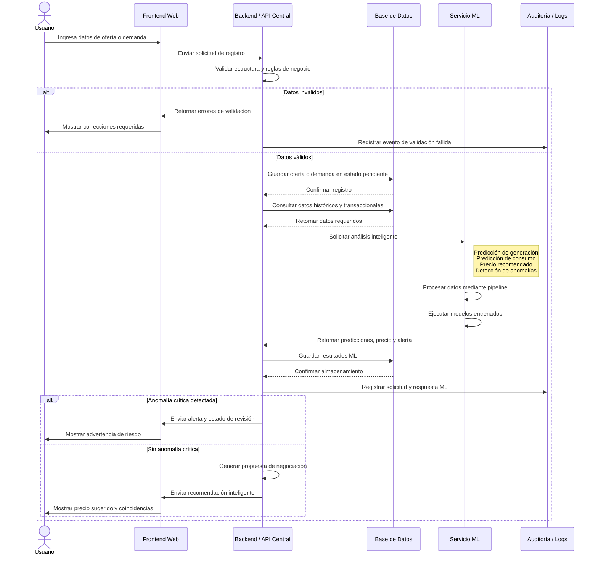

# 

```mermaid
    sequenceDiagram
    actor Usuario
    participant Frontend as Frontend Web
    participant Backend as Backend / API Central
    participant BD as Base de Datos
    participant ML as Servicio ML
    participant Logs as Auditoría / Logs

    Usuario->>Frontend: Ingresa datos de oferta o demanda
    Frontend->>Backend: Enviar solicitud de registro
    Backend->>Backend: Validar estructura y reglas de negocio

    alt Datos inválidos
        Backend->>Frontend: Retornar errores de validación
        Frontend->>Usuario: Mostrar correcciones requeridas
        Backend->>Logs: Registrar evento de validación fallida
    else Datos válidos
        Backend->>BD: Guardar oferta o demanda en estado pendiente
        BD-->>Backend: Confirmar registro

        Backend->>BD: Consultar datos históricos y transaccionales
        BD-->>Backend: Retornar datos requeridos

        Backend->>ML: Solicitar análisis inteligente
        Note right of ML: Predicción de generación<br/>Predicción de consumo<br/>Precio recomendado<br/>Detección de anomalías

        ML->>ML: Procesar datos mediante pipeline
        ML->>ML: Ejecutar modelos entrenados
        ML-->>Backend: Retornar predicciones, precio y alerta

        Backend->>BD: Guardar resultados ML
        BD-->>Backend: Confirmar almacenamiento

        Backend->>Logs: Registrar solicitud y respuesta ML

        alt Anomalía crítica detectada
            Backend->>Frontend: Enviar alerta y estado de revisión
            Frontend->>Usuario: Mostrar advertencia de riesgo
        else Sin anomalía crítica
            Backend->>Backend: Generar propuesta de negociación
            Backend->>Frontend: Enviar recomendación inteligente
            Frontend->>Usuario: Mostrar precio sugerido y coincidencias
        end
    end
```
<b><i> 
    Diagrama 09. 
    Diagrama de secuencia para la generación de recomendación inteligente en EnerTrade AI.
 </i></b>

    