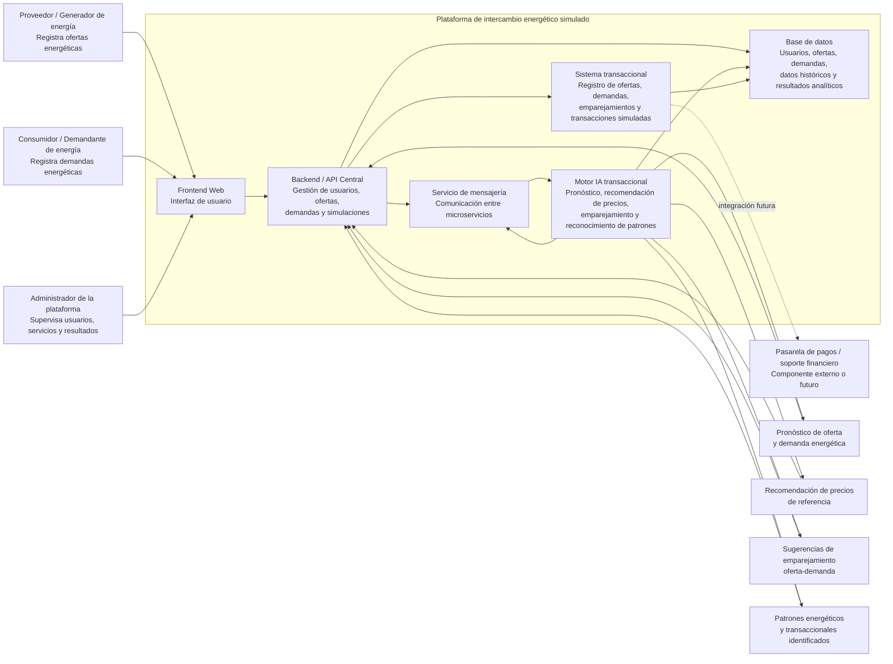

# Diagrama de Arquitectura Lógica - EnerTrade AI

```mermaid
    flowchart LR

    %% Actores externos
    Proveedor["Proveedor / Generador de energía<br/>Registra ofertas energéticas"]
    Consumidor["Consumidor / Demandante de energía<br/>Registra demandas energéticas"]
    Admin["Administrador de la plataforma<br/>Supervisa usuarios, servicios y resultados"]
    Pasarela["Pasarela de pagos / soporte financiero<br/>Componente externo o futuro"]

    %% Sistema principal
    subgraph Plataforma["Plataforma de intercambio energético simulado"]
        Frontend["Frontend Web<br/>Interfaz de usuario"]
        Backend["Backend / API Central<br/>Gestión de usuarios, ofertas,<br/>demandas y simulaciones"]
        Transaccional["Sistema transaccional<br/>Registro de ofertas, demandas,<br/>emparejamientos y transacciones simuladas"]
        MotorIA["Motor IA transaccional<br/>Pronóstico, recomendación de precios,<br/>emparejamiento y reconocimiento de patrones"]
        BD["Base de datos<br/>Usuarios, ofertas, demandas,<br/>datos históricos y resultados analíticos"]
        Mensajeria["Servicio de mensajería<br/>Comunicación entre microservicios"]
    end

    %% Relaciones usuarios - plataforma
    Proveedor --> Frontend
    Consumidor --> Frontend
    Admin --> Frontend

    %% Flujo interno
    Frontend --> Backend
    Backend --> Transaccional
    Backend --> BD
    Backend --> Mensajeria
    Mensajeria --> MotorIA
    MotorIA --> Mensajeria
    MotorIA --> BD
    Transaccional --> BD

    %% Resultados del motor IA
    MotorIA --> R1["Pronóstico de oferta<br/>y demanda energética"]
    MotorIA --> R2["Recomendación de precios<br/>de referencia"]
    MotorIA --> R3["Sugerencias de emparejamiento<br/>oferta-demanda"]
    MotorIA --> R4["Patrones energéticos<br/>y transaccionales identificados"]

    R1 --> Backend
    R2 --> Backend
    R3 --> Backend
    R4 --> Backend

    %% Pasarela externa
    Transaccional -. integración futura .-> Pasarela
```
<b><i> 
    Imagen 00.
    Árbol de problemas del proyecto EnerTrade AI
 </i></b>