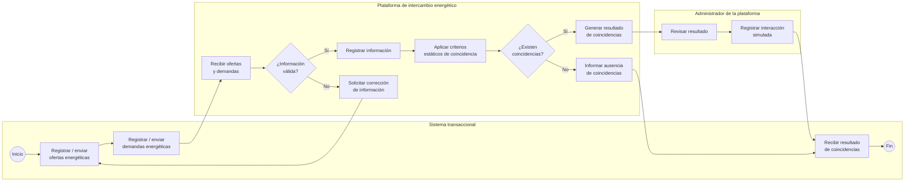

# BPMN AS-IS — EnerTrade AI

```mermaid
    flowchart LR

    %% Proceso actual sin capacidades inteligentes integradas

    subgraph ST["Sistema transaccional"]
        direction LR
        A((Inicio))
        B["Registrar / enviar<br/>ofertas energéticas"]
        C["Registrar / enviar<br/>demandas energéticas"]
        K["Recibir resultado<br/>de coincidencias"]
        L((Fin))
    end

    subgraph PL["Plataforma de intercambio energético"]
        direction LR
        D["Recibir ofertas<br/>y demandas"]
        E{"¿Información<br/>válida?"}
        F["Registrar información"]
        G["Aplicar criterios<br/>estáticos de coincidencia"]
        H{"¿Existen<br/>coincidencias?"}
        I["Generar resultado<br/>de coincidencias"]
        J["Informar ausencia<br/>de coincidencias"]
        X["Solicitar corrección<br/>de información"]
    end

    subgraph AD["Administrador de la plataforma"]
        direction LR
        M["Revisar resultado"]
        N["Registrar interacción<br/>simulada"]
    end

    A --> B
    B --> C
    C --> D

    D --> E

    E -- "No" --> X
    X --> B

    E -- "Sí" --> F
    F --> G
    G --> H

    H -- "Sí" --> I
    H -- "No" --> J

    I --> M
    J --> K

    M --> N
    N --> K
    K --> L
```
<b><i>
    Figura 3.
    BPMN AS-IS — EnerTrade AI
</i></b>

<i>
    Nota. Elaboración propia (2026).
</i>